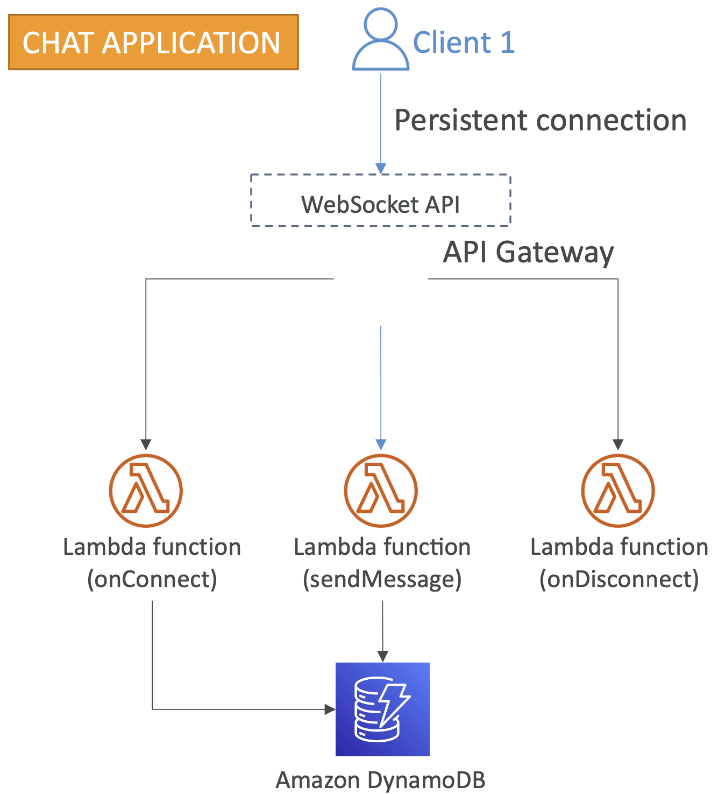

# um-oh-ah-yeh-backend-lambda
학생 및 사회 초년생을 위해 어려운 글 작성 솔루션 서비스 backend with lambda for MS Azure-thon

## ⚙️ 개발 환경(Development Environment)

| 분류 | 개발환경                                                   | 
|---|--------------------------------------------------------|
| 운영체제 | Mac OS, Linux                                          |
| 개발도구 | Pycharm, Postman,               |
| 데이터베이스 | AWS DynamoDB                                                  |
| 버전 관리 | AWS Lambda, Github, Git                                            |
| 배포 및 운영 | AWS Lambda, AWS API Gateway, AWS CloudWatch |
| 오픈소스 및 외부 라이브러리 | openai api                                              |

## 🛠 세부 기술 스택(Tech Stack)

- **Python 3.10**

- **AWS(Amazon Web Service)**
    - AWS Lambda
    - AWS API Gateway
    - AWS Route 53, AWS Certificate Manager
    - AWS Cloudwatch

### 데이터베이스(Database)

- **AWS DynamoDB**

## 인프라 구조

- 웹 소켓 로직을 AWS Lambda를 사용하여 구현
- 사용자의 요청 매핑정보에 따라서 각각의 이벤트 로직이 실행된다.
- RDBMS가 아닌 NOSQL(DynamoDB)를 선택한 이유는 데이터를 영구 저장할 필요가 없는 서비스이고, 커넥션 정보들을 임시로 저장해야 하는데 람다와 가장 잘 어울리고 데이터의 구조도 유연한 NOSQL이기 떄문에 DynamoDB를 선택하였다. 또한 이 DB에서는 커넥션 정보들을 저장하였다.

### 웹소켓 서버를 serverless로 선택 이유

- 이제 막 만드는 서비스이고, 트래픽이 거의 없을것이라고 예상하기 때문이다.
- 시스템 장애에 대응이 용이 -> 백엔드, 인프라를 혼자 관리해야함
- 요청 횟수에 따라서 비용이 발생하고, 프리티어를 사용하면 비용이 발생하지 않거나 거의 발생하지 않을 것이라고 예상하기 때문이다.

### Stage별 환경

Websocket URL: wss://{domain}/{stage}

- 위의 URL의 맨 뒤 경로 표현식에 스테이지명을 적어서 요청할 수 있도록 환경을 별도로 분리
- stage 종류
  - dev
  - prod

### DB 구성 - NOSQL(Document)

- connection_id: 개개인의 사용자의 커넥션을 관리하기 위한 고유값(PK)
- messages: 사용자와 챗봇이 나눈 대화들을 임시로 저장하기 위한 값
  - role: chatgpt api를 사용할 때 역할을 부여하기 위한 값
  - content: chatgpt api를 사용할 때 물어보고 싶은 컨텐츠